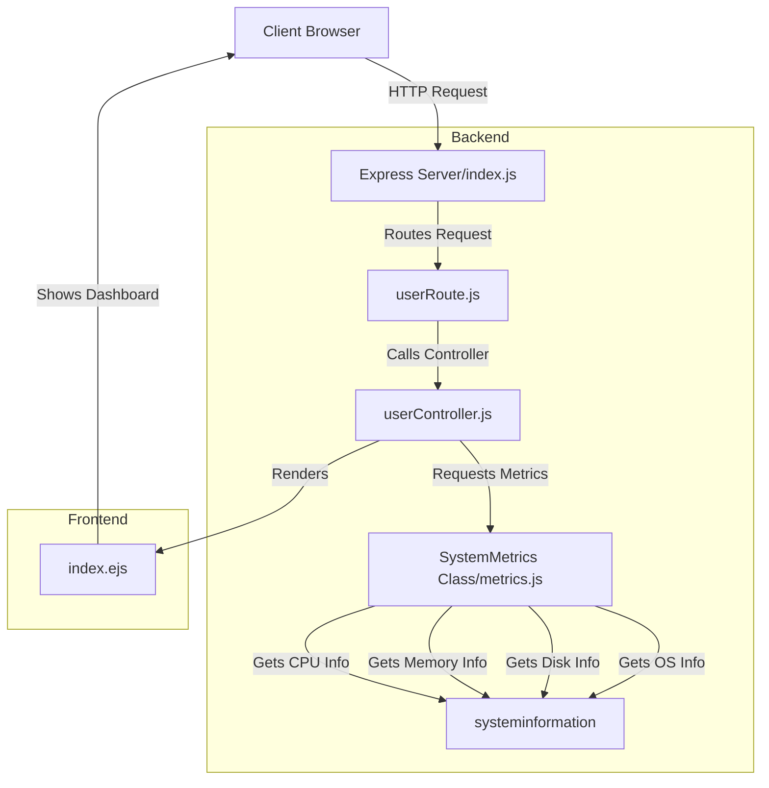

# System Monitoring Web App

## Architecture Flow Diagram

```mermaid
graph TD
    A[Client Browser] -->|HTTP Request| B[Express Server/index.js]
    B -->|Routes Request| C[userRoute.js]
    C -->|Calls Controller| D[userController.js]
    D -->|Requests Metrics| E[SystemMetrics Class/metrics.js]
    E -->|Gets CPU Info| F[systeminformation]
    E -->|Gets Memory Info| F
    E -->|Gets Disk Info| F
    E -->|Gets OS Info| F
    D -->|Renders| G[index.ejs]
    G -->|Shows Dashboard| A

    subgraph Backend
        B
        C
        D
        E
        F
    end

    subgraph Frontend
        G
    end
```